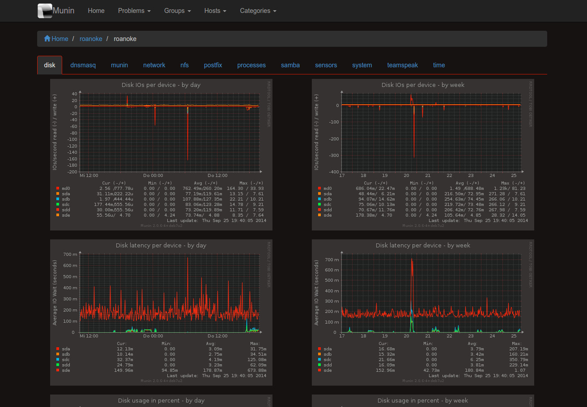

Munstrap-dark
========

Alternative dark Munin 2.x templates based on Twitter Bootstrap 3



Installation
------------

Get Munstrap:

```
cd /etc/munin
git clone https://github.com/Hypfer/munstrap-dark.git
```

Replace the Munin stock template by Munstrap (don't worry, there is a backup of the old files):

```
cp -rb munstrap-dark/templates .
cp -rb munstrap-dark/static .
```

Edit /usr/share/perl5/munin/master/GraphOld.pm (Path may vary) according to colors.patch (because I'm lazy)


Clean the old generated files:

```
rm -rf /var/www/munin/*
```

Take a coffee and wait some minutes for the html generation by Munin.

Upgrades
--------

Get the last changes from Munstrap:

```
cd /etc/munin/munstrap-dark
git pull
```

Replace the old version by the new one:

```
cd /etc/munin
rm -rf templates static
cp -r munstrap/templates .
cp -r munstrap/static .
```

Revert to stock
---------------

```
cd /etc/munin
rm -rf templates static
mv templates~ templates
mv static~ static
```

